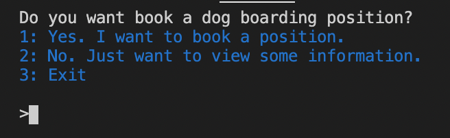
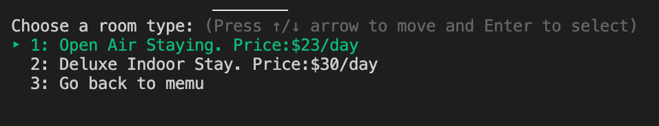
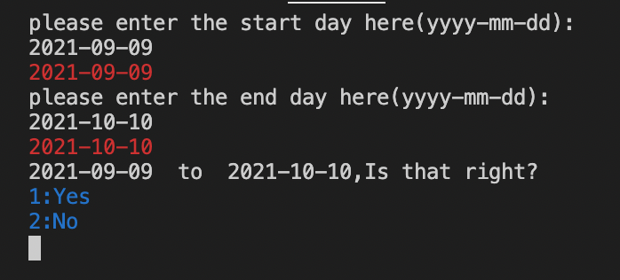
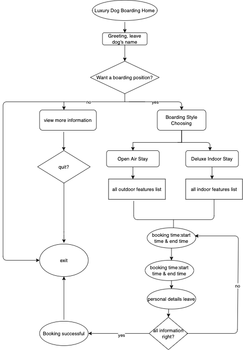
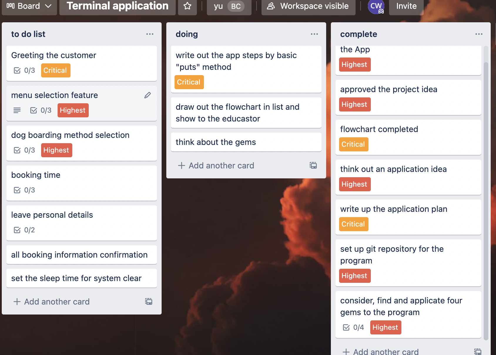
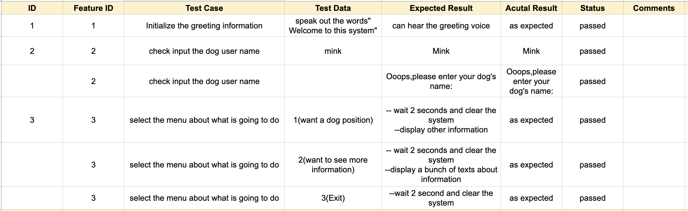
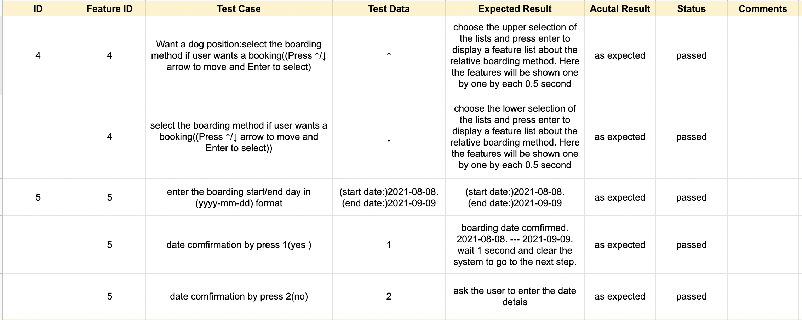
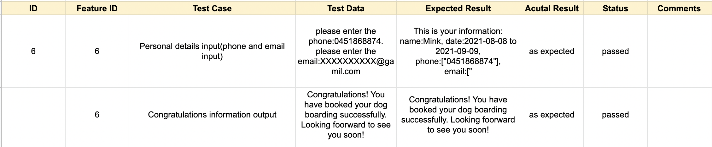

# Terminal-Application

Link to the repository - https://github.com/winny1212/Terminal-Application

# About the APP purpose and scope
This application is a MVP of the Luxury Boarding Home. it is a dog boarding booking system allows the customers to choose a dog boarding position depend on the different features. On commencing the application, the potential customers come into this system, the system will greeting the customer by saying"Welcome to this system" to interact with them and attract their attention. Here the customers will be asked to leave their dogs' name. Then the first step will ask they if they want a dog boarding position booking, if some users just want to have a look about the relative information for the future using, they will enter this selection.

 However, if the customer wants to book a position, they have a series of the steps need to be finished in this booking system. The system will provide the methods(outdoor and indoor) of boarding depend on a bunch of  living features showing to the customers. The users will choose one depend on their dogs personality and the environment they want. Users select the attribute most suitable to them and the outcome will display on the screen. After this, the system will require the users to think about their boarding starting/ending time and enter their personal details. Once the customer complete this part, the system will printed the booking information on the screen and ask the customer to make a comfirmation that all the information is correct or not. If yes, then the system will output "congratulations. The booking is successfully" and the the application terminates.
 
 

If the user just want to see more information about the hotel and selection "2" will show the user more information. When customer want to quit the system, we will ask are you sure you want to quit it out.

Nowadays more and more people choose a dog to company them and some issues will be coming out like "what if the owners leave them for a short period and how they can arrange for their pets. So the application is very useful for those business who provide the dog boarding servie and the mainly target customers are about those people can't look after their dogs for a period time because of business trips, get sick etc.

# Features
1 Dog name input part: Here I will do a auto test by using a "loop do...end" to make sure the users enter the name of their dog. Inside the loop if statement is used, that say if the user input the name of the dog, the loop will stopped. But if the user input nothing, the system will ask the user to input the dog's again until the system can the something.

2 The menu selection part: here I use the case statement to provide the selection for the customer.Users only need to type the relative number to get which selection they want to go. If they select 1, they will go to boiking. If they select 2, they can see more information about the boarding. Or they want to exit the system, they can enter 3.

3 The boarding method selection. In this part, boarding methods are provided by using of tty-prompt gem, selections are limited to the displayed screen. Also, features of each boarding method are packaged by array and each of them is displayed by using colorize gem, each do...end,sleep function.

4 The booking details part. The booking details including dog name, booking time and personal details are assigned into variables which are utilised as outputs on screen for the user. The variables are set as instances of the class Pet, in this class, a variety of features and functions are set to make the user input is correct. These variables are using in the final step of confirmation as well.

# User interaction and experience
-how the user will find out how to interact with / use each feature?
The user will be guided by the system instructions each step like choose the selection or enter some information the system want. For example, during selecting the boarding method part, the system will prompt "if user wants a booking((Press ↑/↓ arrow to move and Enter to select)".
-how the user will interact with / use each feature.
The users will enter the alphabet "Y/N", the number "1,2,3" or the navigate menu selections by way of up and down arrows to interact each features.
-how errors will be handled by the application and displayed to the user.
In this application, I have written a lot of code to reduce the errors happen and each step I have done the manual test for each step in case the error happen during the application. Also, the auto testing for the name inpust are also written in the fiel.

# Diagram

# Develop an implementation plan

# Testing, I manual test each step in this process and record in the file.The testing contents are as following screenshot :

# Use and install the application
-steps to install the application:

Step 1 : install the ruby thtough the homebrew by command line in the terminal
Run the following 4 command lines in the terminal 
<!-- Install homebrew -->
/bin/bash -c "$(curl -fsSL https://raw.githubusercontent.com/Homebrew/install/HEAD/install.sh)"
<!-- install ruby -->
$ brew install ruby
<!-- add execution the command run the program -->
chomd +x run_program.sh
<!-- run the  program-->
./run_program.sh

-any dependencies required by the application to operate
Gems:Because in this application I use four gems inside, espeak, tty-prompt,date and colorize, so I need to running the following command line in the terminal to run the application:
<!-- install bundle -->
gem install bundle
bundle init
bundle add colorize
gem install tty-prompt
bundle add date
gem install espeak

# code file instruction
boarding.rb is the main file that control the flow of the program.

booking_detail.rb set the class that containing all the variables related about the booking time,dog name, user details.

boarding_style.rb define a series of the method to DRY.

# Reference
https://rubygems.org/

